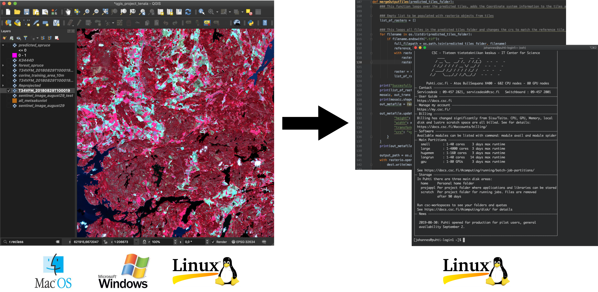
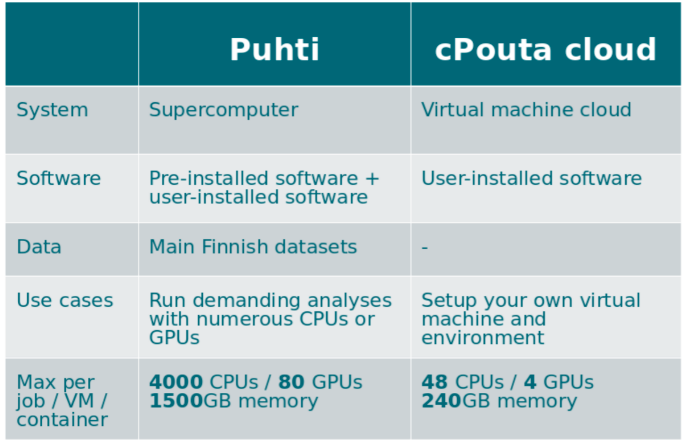
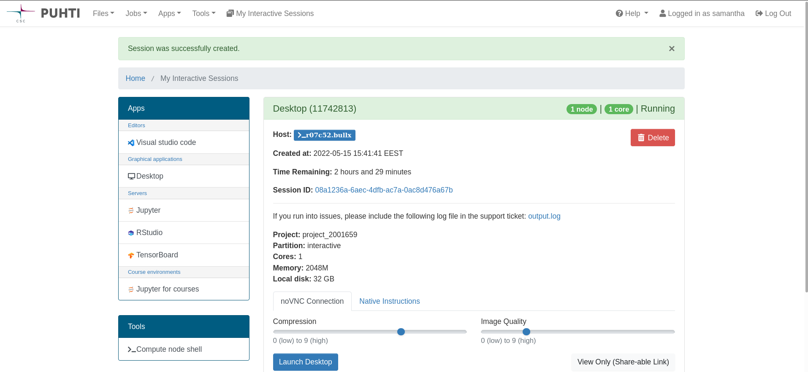
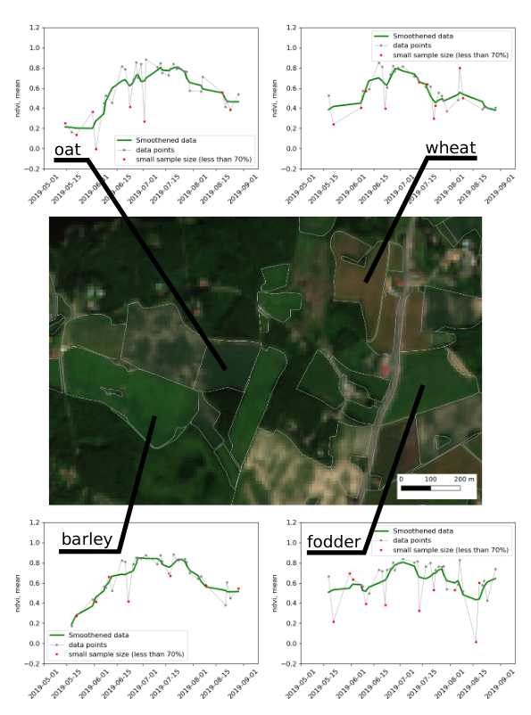

# CSC 

* non-profit state enterprise with special tasks
* owned by Finnish state (70%) and higher education institutions (30%)
* headquaters in Keilaniemi, Espoo
* side offices and supercomputers in Kajaani

# CSC services

[`research.csc.fi/en/service-catalog`](https://research.csc.fi/en/service-catalog)

**Compute & Analyze**

  - cPouta / ePouta
  - Puhti / Mahti / LUMI
  - CSC Notebooks
  - Rahti

**Store, Share & Publish Data**

  * Allas
  * EUDAT
  * IDA
  * Paituli

\+ Sensitive Data (SD) services

# Storing EO data

Allas object storage

* during project lifetime
* CSC account and project required
* access from other services and own computer
* data is immutable
* Maximum size for free: **200TB**

[Allas and Geospatial data webinar](https://www.youtube.com/watch?v=mnFXe2-dJ_g)

# Key to geocomputing

  

# EO data processing and analysis

  

# Pouta cloud

* Virtual Machines
* available on demand
* under own administration
* ideal for webserver / databases

# Why use Puhti?

When own computer is not enough:

* Resource needs (time (> 2 hours), memory (> 8 GB), storage (> 50GB))
* prebuilt environments
* parallelization
* data availability (Paituli)

**-> Outsource heavy computations, keep own computer free**

It’s **free**! (for open science at Finnish higher education and state research institutes)

# Puhti supercomputer

-> High Performance Computing

Main differences to laptop:

* memory and CPU(/GPU) availability
* non-interactive
* resource knowledge

# Computing solutions - Puhti

  

# Puhti webinterface 

-> check your data, testing, code development, file management, quotas, apps

[`puhti.csc.fi`](https://puhti.csc.fi)

  

# Software

[List of Applications in Docs](https://docs.csc.fi/apps/#geosciences)

* **FORCE & SPLITS**
* **GDAL / OGR**
* LasTools 
* MatLab / Octave
* Mapnik
* OpenDroneMap
* **Orfeo Toolbox**
* PCL

* PDAL
* CloudCompare
* **QGIS**
* SagaGIS
* **SNAP, Sen2cor**
* **WhiteboxTools**
* Zonation
* ...

# Python

[Geoconda](https://docs.csc.fi/apps/geoconda/)

* about 600 packages
* for raster, vector, pointcloud processing
* \+ scikit and other data science packages

other modules:

* Deep learning: [tensorflow](https://docs.csc.fi/apps/tensorflow/), [pytorch](https://docs.csc.fi/apps/pytorch/)
-> have geopandas, rasterio

You can also create own environment / install own software! -> [Tykky](https://docs.csc.fi/computing/containers/tykky/)

# R environment on Puhti

* R and RStudio Server
* 1300+ R packages
* Pre-installed libraries / software required by R packages
* Mathematics library for faster calculations (Intel® OneMKL)
* TensorFlow (for using [the R Interface to Tensorflow](https://tensorflow.rstudio.com/))

# Data

almost all data from Paituli +

* SYKE open datasets
* LUKE Multi-source national forest inventory
* NLS Virtual rasters for DEMs

-> '/appl/data/geo'

Sentinel-2 L2A (agricultural Finland, 2016-2021)

-> [Allas](https://a3s.fi/sentinel-readme/README.txt)

[List of Geoscience data sets available from CSC computing environment](https://docs.csc.fi/data/datasets/spatial-data-in-csc-computing-env/)

# What data would you be interested to have available on Puhti/Allas?

-> www.menti.com; 2773 8461

# Common EO challenges

* many tiles, same process
-> "embarassingly parallel" -> Array jobs
* huge "dataframes"
-> dask(Python)/future(R)
* data transfer
-> Allas

# Get access

[Step by step instructions ](https://research.csc.fi/en/accounts-and-projects)

* Account 
* Project
* Resources
* Services
* [Find your account and project information](my.csc.fi)
* [Read the docs](https://docs.csc.fi)
* check our [tutorials](https://docs.csc.fi/support/tutorials/) and [geocomputing examples](https://github.com/csc-training/geocomputing)

# CSC expertise

...at your fingertips:

[`docs.csc.fi`](https://docs.csc.fi)

[`research.csc.fi`](https://research.csc.fi)

**\+ servicedesk@csc.fi**

* Geoinformatics team
* Data analytics and AI team
* Storage team
* Supercomputer team
* Cloudcomputing team
* Accounts team
* ...

# How we can help

* 'Z is not working as expected'
* 'my code gives error Y '
* 'can A be installed to Puhti?'
* 'any advice how to do X?'
* training/example wishes

**-> servicedesk@csc.fi**

* Setting up pipelines, product provision, R&D, ...

**-> CSC as project partner / subcontractor**

[Speed up your request](https://docs.csc.fi/support/support-howto/)

# Training

* ['Using CSC environment efficiently' course](https://csc-training.github.io/csc-env-eff/)
* [18.05: Webinar - CSC´s generic services for storing, sharing and publishing data](https://ssl.eventilla.com/event/pEAl3)
* [09.-10.06: Fundamentals of Machine Learning](https://ssl.eventilla.com/mlfundamentals)
* [CSC geoinformatics training material](https://research.csc.fi/gis-learning-materials)

-> follow our [training calendar](https://www.csc.fi/en/training#training-calendar)

# Thank you for joining this workshop!

**Geoinformatics team at CSC**

Kylli Ek | Samantha Wittke | Katri Tegel

  

  

# Earth Observation Data Information extractor

[Preprint](http://dx.doi.org/10.2139/ssrn.4067133), 
[Gitlab](https://gitlab.com/fgi_nls/public/EODIE), 
[Docs](https://eodie.readthedocs.io/)

EODIE is a toolkit to extract object based timeseries information from Earth Observation data.

* objects as polygons 
* timeframe of interest 
* features (eg vegetation indices) 
 -> per polygon timeseries of the selected features over the timeframe of interest

