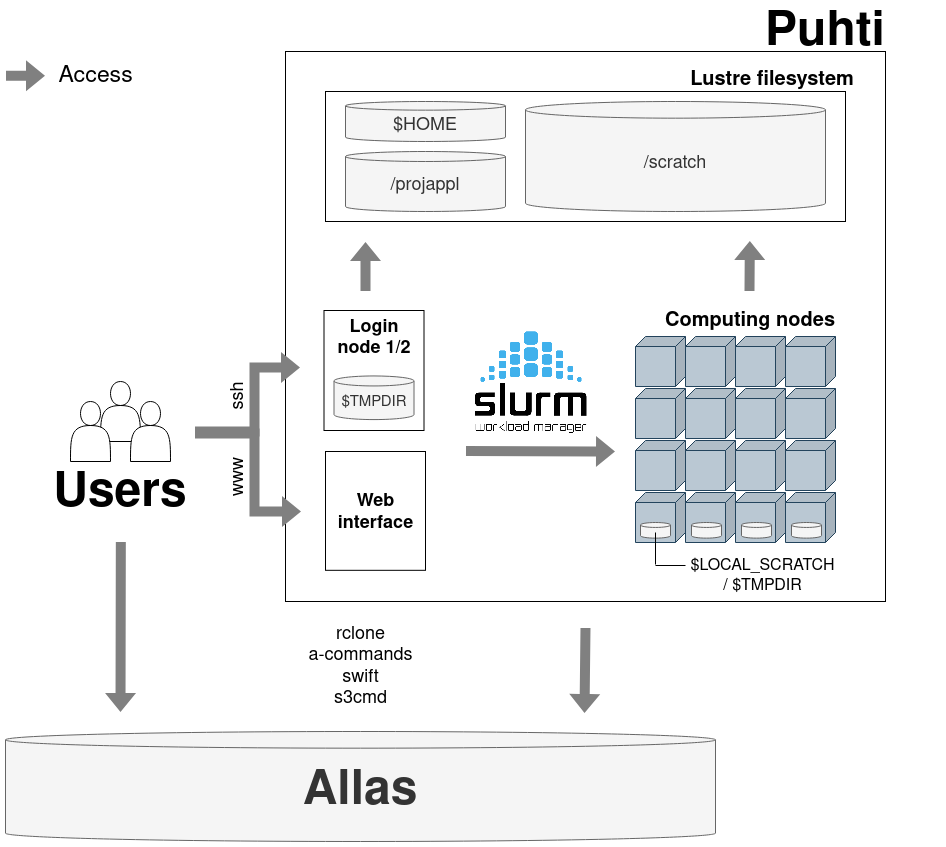

# CSC 

* non-profit state enterprise with special tasks
* owned by Finnish state (70%) and higher education institutions (30%)
* headquaters in Keilaniemi, Espoo
* side offices and supercomputers in Kajaani


# CSC services

[`research.csc.fi/en/service-catalog`](https://research.csc.fi/en/service-catalog)

<div class="column">
**Compute & Analyze**

  - cPouta / ePouta
  - Puhti / Mahti / LUMI
  - Notebooks

</div>

<div class="column">
**Store, Share & Publish Data**

  * Allas
  * EUDAT
  * IDA
  * Paituli

</div>


# Why use CSC resources?

When own computer is not enough:

* Resource needs (time (> 2 hours), memory (> 8 GB), storage (> 50GB))
**-> Outsource computations, keep own computer free**

* **Storing** and **sharing** data
* **Server** needs -> cPouta
* **Course computers** (same setup) -> Notebooks
* It’s **free**! (for open science at Finnish university and state research institute users)


# CSC expertise


...at your fingertips:

<div class="column">
[`docs.csc.fi`](https://docs.csc.fi)

[`research.csc.fi`](https://research.csc.fi)

</div>

<div class="column">
**\+ servicedesk@csc.fi**
* Geoinformatics team
* Storage team
* Supercomputer team
* Cloudcomputing team
* Accounts team
* ...
</div>

# CSC projects

* necessary for doing anything
* needs '**P**rinciple **I**nvestigator'
* PI applies for CSC project with
    * Billing units
    * services
  
Project members share resources, storage and computing storage


# Billing Units (BU)

* per project
* resources (CPU / GPU amount and time) on supercomputer
* Virtual Machine uptime
* Allas storage amount and time

# my.csc.fi

[`my.csc.fi`](https://my.csc.fi)

# Software and data

[List of Applications in Docs](https://docs.csc.fi/apps/#geosciences)
[List of Geoscience data sets available from CSC computing environment](https://docs.csc.fi/data/datasets/spatial-data-in-csc-computing-env/)

# Storage and sharing solutions 


[`research.csc.fi/storage`](https://research.csc.fi/storage)
[`paituli.csc.fi/`](https://paituli.csc.fi/)


# Computing solutions - Puhti


<p align="center">
  
</p>


# Puhti webinterface demo


[`puhti.csc.fi`](https://puhti.csc.fi)


# Example batch job script:

```bash

#!/bin/bash 
#SBATCH --job-name=myTest 
#SBATCH --account=<project> 
#SBATCH --time=02:00:00
#SBATCH --cpus-per-task=4 
#SBATCH --mem-per-cpu=2000 
#SBATCH --partition=small
 
module load geoconda

srun python my_python_script.py input output

```


# Computing resources for you*

<p align="center">
  
</p>


# Getting started

* [Step by step instructions ](https://research.csc.fi/en/accounts-and-projects)
* [Find your account and project information](my.csc.fi)

* [Read the docs](https://docs.csc.fi)

* check our [tutorials](https://docs.csc.fi/support/tutorials/) and [geocomputing examples](https://github.com/csc-training/geocomputing)

  

# Training

* ['Using CSC environment efficiently' course](https://csc-training.github.io/csc-env-eff/)

-> follow our [training calendar](https://www.csc.fi/en/training#training-calendar)


# How we can help

<div class="column">
* 'Z is not working as expected'
* 'my code gives error Y '
* 'can A be installed to Puhti?'
* 'any advice how to do X?'
* training/example wishes

**-> servicedesk@csc.fi**
</div>

<div class="column">
[Speed up your request](https://docs.csc.fi/support/support-howto/)

* Setting up pipelines, product provision, R&D, ...

**-> CSC as project partner / subcontractor**
</div>


# Geoinformatics team { .author } 

| Kylli Ek
| Samantha Wittke
| CSC – IT Center for Science Ltd.

giscoord@csc.fi


