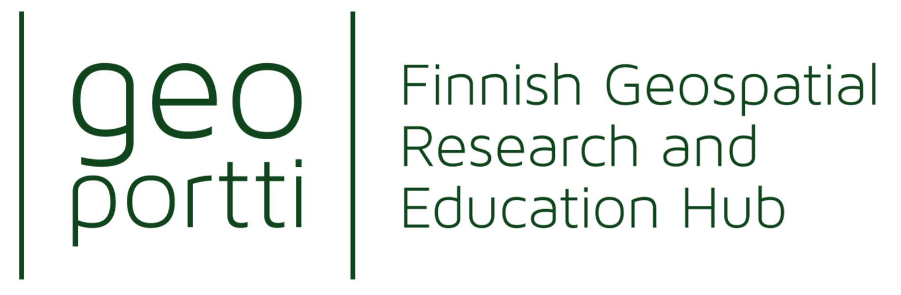
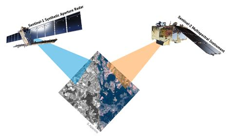
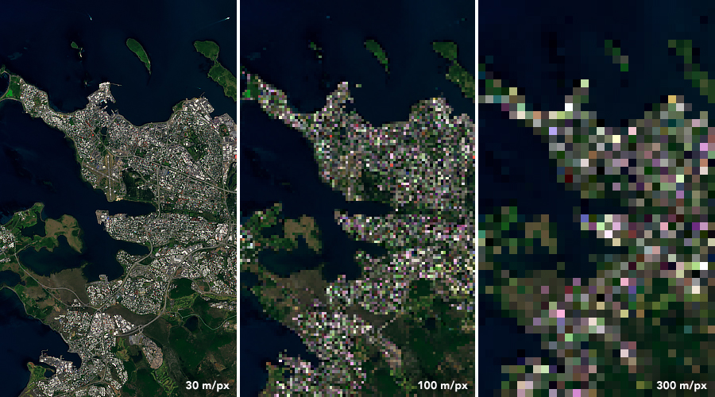

--- 
title: Earth Observation user workshop
subtitle: online
author: Eetu Jutila and Samantha Wittke
date: 16.05.22
lang: en
theme: csc-2016
---

# Practicalities

* Let's discuss a lot
* Many presentations, but please ask questions
* Mentimeter: www.menti.com; 2773 8461
* Accessibility in hybrid event
* Slides: https://a3s.fi/gis-workshops/22_EO_workshop

# Today

* Introduction round
* EO data and processing (general)
* CSC resources for EO
* Use cases of EO research using CSC resources
* Discussion time / Ask us anything

# Introduction

* Who are you?
* What is your research about?
* What would you like to get from this workshop?
-> Mentimeter

# Geoportti and CSC

* Finnish research infrastructure
* CSC is one of many project partners
* technical implementation
* computing support

  

# Getting started using EO 

1. What data are we talking about?
2. Which data to use?
3. Where to get the data?
4. How to get the data?
5. Processing EO data

# EO data 

> Poll: what type of EO data have you used? (optical multispectral, hyperspectral, LiDAR, RADAR, none, specify)

# EM Spectrum

  

> Credit: NASA science

# Sensors

  

> Credit: NASA science

# Optical vs RADAR

  

> Credit: ESA Phi lab

# Resolution

Radiometric - Spectral - Temporal - Spatial/Geometric

 

  

    
  

  

    
  

 

> Credit: NASA Earth Observatory images by Joshua Stevens, using Landsat data from the U.S. Geological Survey; NASA Earth Observatory

# How to decide which data to use?

**What information is needed?**

* structural vs spectral characteristics
* details
* time series

**Budget?**

**Handling**

* experience 
* pre-processing needs

# Where and how to get data?

# Mosaics

# Geocubes

# FinHub

# other "hubs"

# Paituli

[www.paituli.csc.fi](https://paituli.csc.fi)

* ~13 TB data with webbased data preview
* spatial data download service
* some EO data products, possible reference data 
* open to anyone, unrestricted access
* includes historical versions of datasets
* not limited to Finland

# download vs data and processing platforms

# What to consider when choosing a place to get data from?

# What to consider when choosing a method to download data?

# Own suggestions

# How to process the data?
> general considerations, GUI vs CLI vs Python/R/Julia/Matlab/...

# GUI

# CLI

# Python/R/Julia/Matlab,...

# A few common EO processing steps

**Optical multispectral**

* atmospheric correction
    -> Sen2cor, FORCE, OTB, ...
* cloud identification and masking
    -> FORCE, SNAP, Python (s2cloudless), R (sen2r)...
* calculation of (vegetation) indices
    -> raster calculator/band math/ map algebra: QGIS, SNAP, Python (rasterio, numpy), R (sen2r)... 
* zonal statistics 
    -> QGIS, Python (rasterstats),...
* ...

**RADAR**

* Calibration
* Terrain Correction
* ...

**any**

* download
    -> Python (sentinelsat), R (sen2r), ...
* mosaicing
    -> Python (sen2mosaic, sen1mosaic), ...