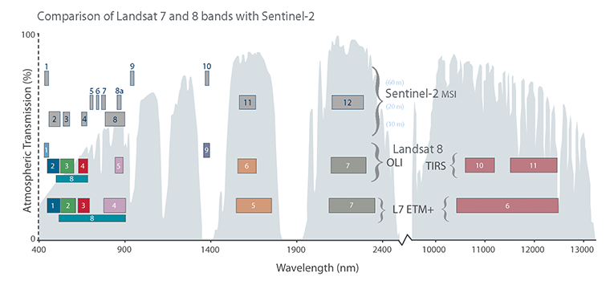
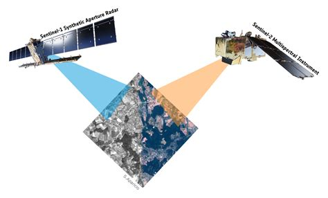
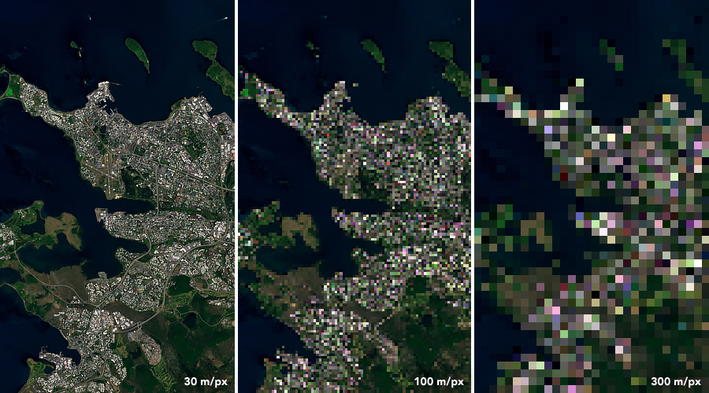

# EO data 

# EM Spectrum

<p align="center">
  
</p>

> Credit: NASA science

# Bands

<p align="center">
  
</p>

> Credit: Landsat Science

# Sensors

<p align="center">
  
</p>

> Credit: NASA science

# Optical vs RADAR

<p align="center">
  
</p>

> Credit: ESA Phi lab


# Resolution

Radiometric - Spectral - Temporal - Spatial/Geometric

 <div class="row">
  <div class="column">
    
  </div>
  <div class="column">
    
  </div>
</div> 

> Credit: NASA Earth Observatory images by Joshua Stevens, using Landsat data from the U.S. Geological Survey; NASA Earth Observatory


# Approaching parallelization

-> domain decomposition <X,Y,Z,T,V>

* software with inbuilt support (--cores, --cpus,...)
* parallelization within Python (dask, multiprocessing, joblib) /R (future, snow, foreach)
* GNU parallel, array jobs,...

# Parallel Geospatial software
<div class="column">
* SAGA GIS (some tools)
* ArcGIS Pro 
* GRASS
* SNAP 
</div>

<div class="column">
**Parallel libraries for Python**

* dask
* multiprocessing
* joblib

**Parallel libraries for R**
* future
* snow
* foreach
</div>

# my.csc.fi

[`my.csc.fi`](https://my.csc.fi)

**CSC projects**

* necessary for doing anything
* needs '**P**rinciple **I**nvestigator'
* PI applies for CSC project with
    * Billing units
    * services
  
Project members share resources, storage and computing storage


# Puhti job submission

Example batch job script:

```bash

#!/bin/bash 
#SBATCH --job-name=myTest 
#SBATCH --account=<project> 
#SBATCH --time=02:00:00
#SBATCH --cpus-per-task=4 
#SBATCH --mem-per-cpu=2000 
#SBATCH --partition=small
 
module load geoconda

srun python my_python_script.py input output

```

# my.csc.fi

[www.my.csc.fi](https://my.csc.fi)

# Puhti web interface

[`www.puhti.csc.fi`](https://puhti.csc.fi)


# Mahti / LUMI

* mainly large GPU computations
* limited software availability
* LUMI: 
  * CPU partition ready, GPU coming soon
  * companies
  * international collaboration
  * own object storage

# Pouta

cPouta

* Cloud service
* Virtual Machines for project use
* “Clean sheet” with root access
→ setup from scratch
  * Operating System (any Linux distributions)
  * Firewall
  * Software
  * Data

ePouta for sensitive data → more strict network rules

# Sensitive Data Services


"Secure workspace for all phases of research"

<br></br>

<div class="column">
* webinterface 
* on-demand
* data-controller
* always encrypted
</div>

<div class="column">

* **SD Connect**: store and share 
* **SD Desktop**: isolated, secure private cloud environment 
* **SD Submit**: publish under controlled access (pilot)
* **SD Apply**: re-use (pilot)

</div>

# Paituli

[www.paituli.csc.fi](https://paituli.csc.fi)

* publish own geospatial datasets -> URN

**Access**

**OGC webservices:**

* WMS (maps, map image for viewing)
* WMTS (maptiles, map image tiles for viewing)
* WFS (features; vector data)
* WCS (coverage, raster data

**Download:**

* webinterface,
* bulk download: http, ftp, rsync

# Allas

* access
* Pouta webinterface
* immutable objects
* read directly with GDAL/rasterio

# Matlab

Matlab parallel server (MPS)
* Matlab on own computer with own license
* parallel computing toolbox needed
* CSC has serverside toolbox

Limited also available on Puhti webinterface

# HTC

[New HTC page](https://csc-guide-preview.rahtiapp.fi/origin/throughput-rework/computing/running/throughput/)

# Notebooks

[www.notebooks.csc.fi](https://notebooks-beta.rahtiapp.fi/welcome)